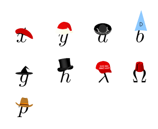

# realhats LaTeX package

realhats is a package for LaTeX that makes `\hat` put real hats on symbols.
A reasonably up-to-date version of realhats is available from the [CTAN archive](https://ctan.org/pkg/realhats).

Regretfully brought into the world by [Matthew Scroggs](https://github.com/mscroggs) and [Adam Townsend](https://github.com/Pecnut).

## Thanks to 
* Smitha Maretvadakethope
* Pedro Horse

## Example

## Changelog
### Version 2.0
* Replaced tikz with stackengine
* Added top hat, make LaTeX great again hats, fez, cowboy hat
### Version 1.0
* First working version of package
* Added five hats
* Added documentation

## Licensing
This work may be distributed and/or modified under the conditions of the [MIT license](LICENSE.txt).
